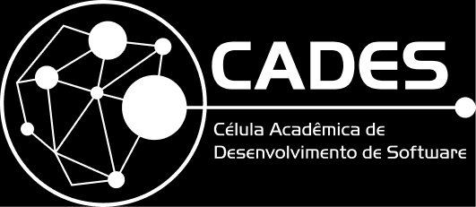
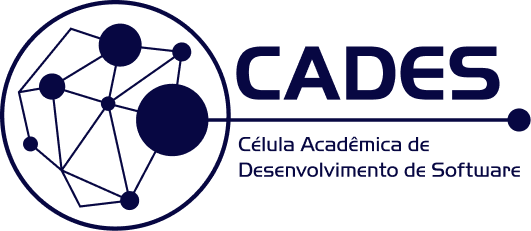

:art: Guias e regras para a utilização da marca CADES.

## Logotipo

Nossa marca foi decidida através de uma [votação democrática (#6)](https://github.com/cades-ifrn/sobre/issues/6).

### Formatos

* [JPG](/src/jpg/)
* [PNG](/src/png/)
* [SVG](/src/svg/)
* [AI](/src/ai/)

## Cores

### Hex

* Azul `#070742`
* Amarelo `#E4BB12`

### RGB

* Azul `7, 7, 66`
* Amarelo ` 228, 187, 18` 

### CMYK

* Azul `100%, 95%, 41%, 53%`
* Amerelo `9%, 22%, 94%, 1%`

### Tipografia

**HandelGothic**

## Versões

### Horizontal

##### Preto e Branco

##### Preto

##### Branco

##### Azul

##### Amarelo

### Símbolo

##### Normal

##### Vazado

##### Preenchido

## Licença

MIT &copy; CADES